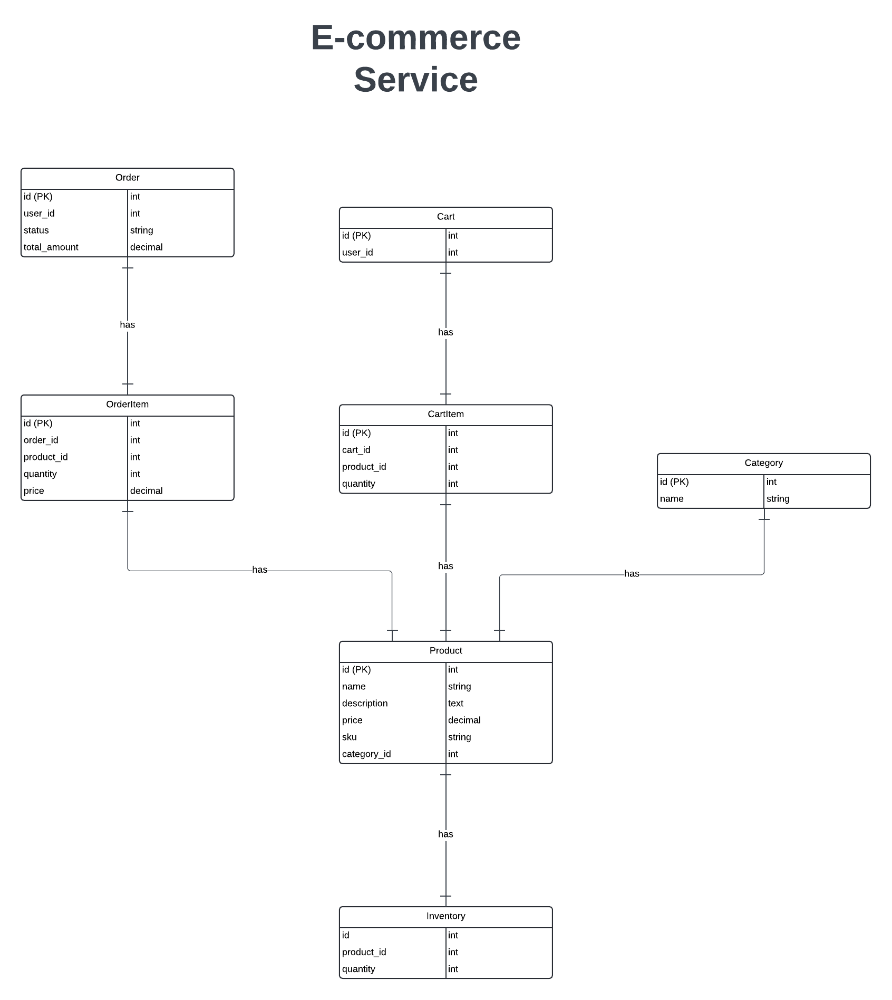

# ecommerce-service

A ecommerce service that focuses on product management and order processing.

## ERD

## Services

### **Product Catalog Service**

**Purpose**

* Manages core product information, including descriptions, pricing, images, and categories.
* Provides the source of product data for other services within the e-commerce system.

**Entities**

* **Product**
   * id (integer, primary key)
   * name (string)
   * description (text)
   * price (decimal)
   * sku (string)
   * image_url (string)
   * category_id (integer, foreign key reference to Category)

*  **Category**
    *  id (integer, primary key)
    *  name (string)
    *  parent_category_id (integer, self-referencing foreign key for hierarchies)

**API Endpoints**

* **GET /products/{id}** 
   * Retrieves details for a specific product by its ID.

* **GET /products** 
   * Retrieves a list of products.
   * Supports optional query parameters for:
      * Search terms (search by name, description)
      * Category filtering
      * Pagination
 
* **GET /products/search**
   * Search products by name

* **GET /categories/{id}**
   * Retrieves details for a specific category by its ID.
  
* **GET /categories**
   * Retrieves a list of available product categories.
   * Potentially supports a hierarchical view (if the category structure allows it).

* **GET /categories/search**
   * Search categories by name

* **POST /products** - Create a new product
* **PUT /products/{id}** - Update an existing product
* **DELETE /products/{id}** - Delete a product
* **POST /categories** - Create a new category
* **PUT /categories/{id}** - Update an existing category

### **Inventory Management Service**

**Purpose**

* Tracks stock levels for each product.
* Decrements stock upon successful order placement.

**Entities**

* **InventoryItem**
    * id (integer, primary key)
    * product_id (integer, foreign key reference to Product)
    * quantity (integer)

**API Endpoints**

* **GET /inventory/{product_id}/availability**
    * Retrieves available stock for a specific product

* **PUT /inventory/{product_id}/hold**
    * Places a temporary hold on a specified quantity of a product (associates it with a Cart if relevant).
    * Should include an expiration mechanism for holds.

* **PUT /inventory/{product_id}/decrement**
    * Decrements the stock level for a product, usually triggered after order placement.

### **Cart Service**

**Purpose**
Manages cart

**Entities**

* **Cart**
    * id (integer, primary key)
    * user_id (UUID, user id)
    * created_at (timestamp)
    * updated_at (timestamp)
* **CartItem**
    * id (integer, primary key)
    * cart_id (integer, foreign key reference to Cart)
    * product_id (integer, foreign key reference to Product)
    * quantity (integer)

**API Endpoints**

* **GET /cart**
    * Retrieve user's cart

* **POST /cart**
    * Add products to cart

* **DELETE /cart**
    * Clears user's cart

* **PUT /cart/items/{id}**
    * updates cart items quantity

* **DELETE /cart/items/{id}**
    * Removes item from cart

### **Order Service**

**Purpose**
Manages order

**Entities**

* **Order**
    * id (integer, primary key)
    * user_id (UUID, user id)
    * status ("pending", "processing", "shipped", "cancelled", "refunded")
    * total_price (float)
    * order_items ([]OrderItem)
    * created_at (timestamp)
    * updated_at (timestamp)
* **OrderItem**
    * id (integer, primary key)
    * order_id (integer, foreign key reference to Order)
    * product_id (integer, foreign key reference to Product)
    * quantity (integer)
    * price (float)

**API Endpoints**

* **GET /orders**
    * Retrieve user's orders

* **GET /orders/{id}**
    * Retrieve order

* **POST /orders**
    * Creates order

* **PUT /orders/{id}/status**
    * updates order status
